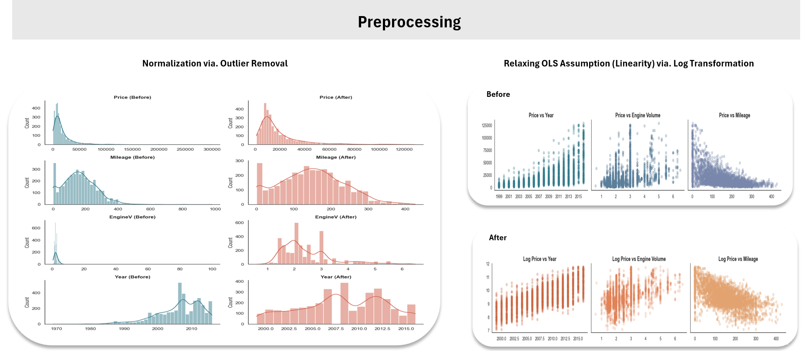
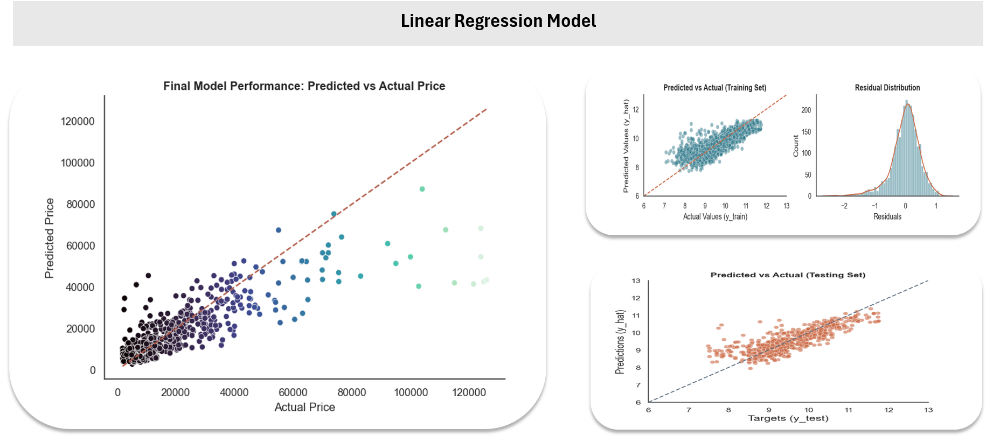

# Car Price Prediction Using Linear Regression
This project applies Linear Regression to predict car prices based on various features such as mileage, engine size, and year of manufacture. The goal is to build a simple yet interpretable model that gives insight into how different car attributes influence the price.


## 📁 Project Structure

```plaintext
car-price-prediction/
├── data/
│   └── car_data.csv
├── notebooks/
│   └── car_price_prediction.ipynb
├── visuals/
├── README.md
└── requirements.txt
```


## Dataset
- Source: Uploaded manually by the user (assumed to be a cleaned dataset).
- Filename: second_hand_car_data.csv
- Features include:
  - `Brand`
  - `Body`
  - `Mileage`
  - `EngineV`
  - `Engine Type`
  - `Price` (target variable)


## Methodology

1. **Exploratory Data Analysis (EDA)**:
   - Examined the relationship between features and price using scatterplots and correlations.
   - Identified skewness in `Price`, `Mileage`, and `Year`.

2. **Preprocessing**:
   - Handled outliers.
   - Check the OLS assumptions.
   - Relaxed Linearity assumptions with log-transformation.
   - Addressed multi-colinearity.
   - Created dummies for catrgorical features.
   - Selected `year`, `engineSize`, and `log(mileage)` as predictors.
  
     

4. **Modeling**:
   - Selected `Log(Price)` as the target and `Brand`, `Body`, `Mileage`, `EngineV`, `EngineType` s predictors.
   - Standardized the input features.
   - Applied **Linear Regression** using scikit-learn.
   - Trained the model on 80% of the data and tested on the remaining 20%.
   - Calculated the weights and bias.

     

6. **Evaluation**:
   - Performance measured by examining R² and the residual.
   - Plotted actual vs. predicted prices for the testing set.


## Model Performance Results

- The model performed well with an R² score of approximately **0.67** on the test set, explaining 67% of the variability in car prices.
- **Reliable across most price ranges**: The model performs consistently well for the majority of vehicles, particularly those in the low to mid-price range, producing accurate and stable predictions.
- **Less accurate for very low-priced cars**: Predictions for vehicles priced under \$5,000 tend to be more scattered and less reliable. This may be due to missing or unaccounted factors such as vehicle condition, mileage extremes, or previous damage—factors that heavily influence prices in this segment.
- **Residual bias at lower prices**: Analysis of residuals reveals a tendency to **overestimate** the price of some low-end outliers, as indicated by predominantly negative residuals in this range.
- **Underestimation of luxury vehicles**: The model tends to **underestimate** the prices of high-end cars (above \$60,000), likely due to their limited representation in the dataset. As a result, the model struggles to fully capture the pricing dynamics of the luxury segment.


## Insights

The Linear Regression model not only provides reasonably accurate price predictions but also offers interpretable insights into how different factors influence car value.

Key takeaways include:

- **Feature influence is interpretable**: Coefficients reveal how various features like mileage, engine size, brand, and engine type affect price—positively or negatively.
- **Mileage strongly impacts value**: As expected, higher mileage generally lowers a car’s predicted price.
- **Engine size contributes positively**: Larger engine volumes are associated with higher prices.
- **Brand and engine type matter**: Certain brands and engine types significantly influence price, either increasing or decreasing it compared to a baseline (Audi). BWM and Mercedes-Benz were associated with higher prices compared to the rest while Petrol engines were linked to lower prices in used cars.
- **Supports exploratory analysis**: The model helps identify pricing trends and market behaviors, which can be useful for buyers, sellers, or businesses analyzing vehicle value.

These insights reflect real-world market trends and validate the model's utility as an exploratory tool for car pricing analysis.


## How to Run

Follow these steps to set up and run the project locally:

1. **Clone the repository**:
   ```
   git clone https://github.com/shree131/car-price-prediction-model.git
   cd car-price-prediction-model
   ```

2. **Install the required packages**:
   ```
   pip install -r requirements.txt
   ```
  
4. **Launch Jupyter Notebook:**
   ```
   jupyter notebook notebooks/car_price_prediction.ipynb
   ```

6. **Explore the notebook**:
   The notebook walks through data loading, preprocessing, exploratory analysis, model building, evaluation, and insights.


---
*© 2025 All rights are reserved.*
